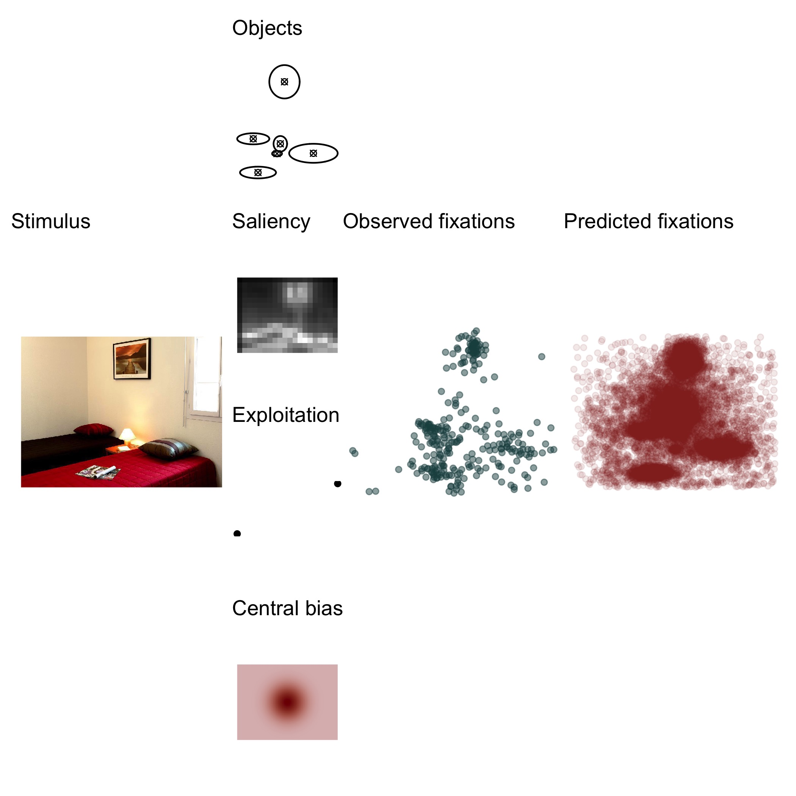

Dynamic Model of Eye Movements
================

This repository provides code and additional materials associated with
the article

> Kucharský, Š., van Renswoude, D., Raijmakers, M.E.J., & Visser, I.
> (2020). Dynamic model of eye movements (provisional title).

### Getting started

Running the model requires two crucial dependencies:

1.  R (version 3.6.3 was used to create the original output). To
    download R, visit <https://www.r-project.org/>. Optionally, use R
    Studio (<https://rstudio.com/>).

2.  Stan and R package rstan. Visit <https://mc-stan.org/> for more
    information, installation instruction, manual, and tutorials.

To reproduce all code and output, there are additional dependencies,
mostly in the form of additional R packages. The list of R packages (and
their versions) is available in the [packages.csv](packages.csv) file,
and the full R environment listed in [sessionInfo](sessionInfo) file.

To install all necessary R packages, simply run

    packages <- read.csv("packages.csv", stringsAsFactors = FALSE)
    install.packages(packages$package)

Or to get the packages in their specified versions

    # install.package("devtools")
    library(devtools)
    packages <- read.csv("packages.csv", stringsAsFactors = FALSE)
    devtools::install(pkg = packages$package, version = packages$version)

Additionally, we calculated saliency maps of images created by Xu et al.
(2014) stored at
<https://github.com/NUS-VIP/predicting-human-gaze-beyond-pixels> using
Python (version 3.7.7, <https://www.python.org/>). We used functions
that compute saliency of images that were originally created by [Mayo
Yamasaki](https://github.com/mayoyamasaki/saliency-map) for Python 2 and
rewritten by [Kohki Yamagiwa](https://github.com/tamanobi/saliency-map)
for Python 3. Using these resources is not strictly necessary to produce
the main output as the saliency maps were saved in folder
[data/saliency](data/saliency/).

### Structure of the repository

1.  [`stan/`](stan/) folder contains all necessary `.stan` files used
    for fitting the model, generating posterior predictives, and
    cross-validation.
    
    1.  [`helpers/`](stan/helpers/) folder contains definitions of
        functions that are used in the stan files. These functions are
        copied into the `.stan` scripts using the directive `#include
        "path_to_file.stan"` to be used as user defined functions. The
        file [`load_functions.stan`](stan/helpers/load_functions.stan)
        makes it easier as including only that file includes all files
        present in the [`helpers/`](stan/helpers) folder.
    2.  [`examples/`](stan/examples/) folder contains definitions of toy
        models that are used in the [`documents/`](documents/) folder to
        demonstrate how to build a model like the one we present in the
        article.
    3.  [`objects_central_distance_saliency.stan`](stan/objects_central_distance_saliency.stan)
        is the main `.stan` file used to fitting the data with the
        initial four factor model.
    4.  [`objects_central_distance_saliency_horizontal.stan`](stan/objects_central_distance_saliency_horizontal.stan)
        is the main `.stan` file used to fitting the data with the
        extended five factor model.
    5.  [`log_lik_objects_central_distance_saliency.stan`](stan/log_lik_objects_central_distance_saliency.stan)
        is a `.stan` file to compute the log-likelihood of the data
        under the initial four factor model.
    6.  [`log_lik_objects_central_distance_saliency_horizontal.stan`](stan/log_lik_objects_central_distance_saliency_horizontal.stan)
        is a `.stan` file to compute the log-likelihood of the data
        under the extended five factor model.
    7.  [`gqs_objects_central_distance_saliency.stan`](stan/log_lik_objects_central_distance_saliency.stan)
        is a `.stan` file for generating posterior predictives from the
        initial four factor model.
    8.  [`gqs_objects_central_distance_saliency.stan`](stan/log_lik_objects_central_distance_saliency.stan)
        is a `.stan` file for generating posterior predictives from the
        extended five factor model.
    9.  [`try_this.stan`](stan/try_this.stan) is a simple `.stan` file
        that can be used to debug possible linking errors (i.e., in case
        some `helper` functions were not loaded in Stan.

2.  [`data/`](data/) folder contains data that are used in this project.
    The eye-tracking data are associated with the article by Renswoude
    et al. (2019) who used the stimli materials from Xu et al. (2014).
    
    1.  [`saliency/`](data/saliency/) folder contains all 700 stimuli
        from the repository by xu2014beyond
        (<https://github.com/NUS-VIP/predicting-human-gaze-beyond-pixels>)
        converted to saliency maps and saved as `.jpg` files. The folder
        contains [`get_saliency.py`](data/saliency/get_saliency.py)
        script that should (provided necessary dependencies are
        included, see above) reproduce the output.
    2.  [`cleaned_data.Rdata`](data/cleaned_data.Rdata) collects a work
        space with data objects that are otherwise shared in form of
        `.csv` files in the [`data/`](data/) folder.

3.  [`documents/`](documents/) folder contains files that provide
    additional background information about the model, including
    explanations of helper functions, implementation of the model in the
    Stan modeling language, etc. The aim of this folder is to collect
    all possible information that is useful for adapting the model to
    your own needs rather than simply reruning the code in this
    repository.

4.  [`R/`](R/) folder contains function definitions that are used in the
    project, or additional scripts that are used to maintain this
    repository.

5.  [`scripts/`](scripts/) folder contains the R scripts that were used
    to produce the output: data preparation, fitting model(s), model
    diagnostics and comparison, plotting, etc. The scripts should be
    relatively modular/standalone, and so each script should be able to
    produce its own output regardless of which script ran first. It is
    advised to run each script in a fresh R session. For completeness,
    the project output was created in this order:
    
    1.  [`prepare_data.md`](scripts/prepare_data.md) is an output of an
        [rmarkdown script](scripts/prepare_data.Rmd) and processes the
        data. This script is responsible for creating all contents of
        the [`data/`](data/) folder.
    2.  [`fit_model.R`](scripts/fit_model.R) is a script that fits and
        saves the ‘initial model’ using Stan.
    3.  [`diag_model.R`](scripts/diag_model.R) is a script that produces
        ‘initial model’ diagnostics (including [diagnostic
        plots](figures/fit_model/par_diagnostics), and parameter
        estimates.
    4.  [`posterior_predictives_in_sample.R`](scripts/posterior_predictives_in_sample.R)
        and
        [`posterior_predictives_out_sample.R`](scripts/posterior_predictives_out_sample.R)
        are scripts that produce the posterior predictive checks of the
        ‘initial model’, or more formally retrodictive and predictive
        checks.
    5.  [`fit_model_horizontal.R`](scripts/fit_model_horizontal.R) is a
        script that fits and saves the ‘extended model’ using Stan.
    6.  [`diag_model_horizontal.R`](scripts/diag_model_horizontal.R) is
        a script that produces ‘initial model’ diagnostics (including
        [diagnostic
        plots](figures/fit_model_horizontal/par_diagnostics), and
        parameter estimates.
    7.  [`posterior_predictives_in_sample_horizontal.R`](scripts/posterior_predictives_in_sample_horizontal.R)
        and
        [`posterior_predictives_out_sample_horizontal.R`](scripts/posterior_predictives_out_sample_horizontal.R)
        are scripts that produce the posterior predictive checks of the
        ‘extended model’, or more formally retrodictive and predictive
        checks.
    8.  [`model_comparison.R`](scripts/model_comparison.R) is a script
        that compares the two models to each other.

6.  [`saves/`](saves/) folder contains some R objects that were saved to
    make some output reusable (e.g., so that R scripts that depend on
    other’s scripts output can be run independently).

7.  [`figures/`](figures/) folder contains figures that we generated for
    the article, or as part of the model diagnostics. The folder itself
    has some `.R` scripts which generate figures that are used in the
    article for illustration. There are 2 additional subfolders:
    
    1.  [`fit_model/`](figures/fit_model) contains plots associated with
        the initial model containing four factors.
    2.  [`fit_model_horizontal/`](figures/fit_model_horizontal) contains
        plots associated with the extended model containing five
        factors.
    
    Each of these two subfolders have the following structure:
    
    1.  [`in_sample`](figures/fit_model/in_sample) contains the
        posterior predictives on the data that were used to fit the
        model (aka posterior “retrodictives”).
    2.  [`out_sample`](figures/fit_model/out_sample) contains the
        posterior predictives on the data that were used for
        cross-validation.
    3.  [`par_diagnostics`](figures/fit_model/par_diagnostics) contains
        diagnostic plots of the MCMC chains.

NB. The paths to files and folders are defined using the package `here`
(Müller, 2017), and rely on the presence of the file
[`DMEM.Rproj`](DMEM.Rproj) or [`.here`](.here) in the root of this
repository (i.e., the paths are relative to these to files, and their
location is assumed to be in the root of the repository). Provided at
least one of these files is present, and the working directory is
anywhere inside of this repository, the paths should “just work”.

## References

Müller, K. (2017). *Here: A simpler way to find your files*.
<https://CRAN.R-project.org/package=here>

Renswoude, D. R. van, Voorvaart, R. E., Berg, L. van den, Raijmakers, M.
E., & Visser, I. (2019). Object familiarity influences infant gaze
control during free scene viewing. *Manuscript in Preparation*.

Xu, J., Jiang, M., Wang, S., Kankanhalli, M. S., & Zhao, Q. (2014).
Predicting human gaze beyond pixels. *Journal of Vision*, *14*(1),
28–28. <https://doi.org/10.1167/14.1.28>

