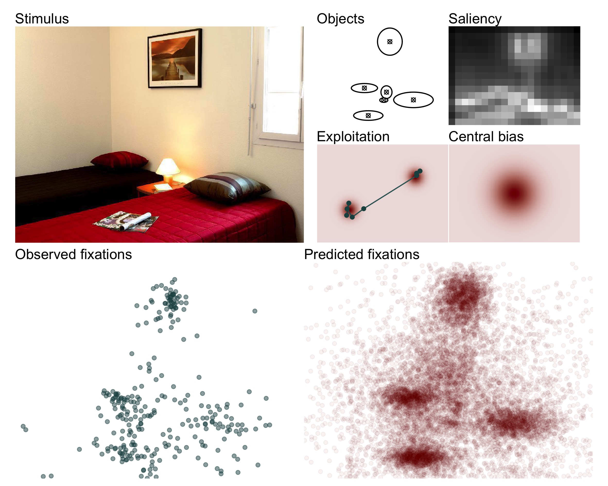

Dynamic Model of Eye Movements
================

This repository provides code and additional materials associated with
the article

> Kucharský, Š., van Renswoude, D., Raijmakers, M.E.J., & Visser, I.
> (2020). Dynamic model of eye movements (provisional title).

### Getting started

Running the model requires two crucial dependencies:

1.  R (version 3.6.3 was used to create the original output). To
    download R, visit <https://www.r-project.org/>. Optionally, use R
    Studio (<https://rstudio.com/>).

2.  Stan and R package rstan. Visit <https://mc-stan.org/> for more
    information, installation instruction, manual, and tutorials.

To reproduce all code and output, there are additional dependencies,
mostly in the form of additional R packages. The list of R packages (and
their versions) is available in the [packages.csv](packages.csv) file,
and the full R environment listed in [sessionInfo](sessionInfo) file.

To install all necessary R packages, simply run

    packages <- read.csv("packages.csv", stringsAsFactors = FALSE)
    install.packages(packages$package)

Or to get the packages in their specified versions

    # install.package("devtools")
    library(devtools)
    packages <- read.csv("packages.csv", stringsAsFactors = FALSE)
    devtools::install(pkg = packages$package, version = packages$version)

Additionally, we calculated saliency maps of images created by Xu, et
al. (2014) stored at
<https://github.com/NUS-VIP/predicting-human-gaze-beyond-pixels> using
Python (version 3.7.7, <https://www.python.org/>). We used functions
that compute saliency of images that were originally created by [Mayo
Yamasaki](https://github.com/mayoyamasaki/saliency-map) for Python 2 and
rewritten by [Kohki Yamagiwa](https://github.com/tamanobi/saliency-map)
for Python 3. Using these resources is not strictly necessary to produce
the main output as the saliency maps were saved in folder
[data/saliency](data/saliency/).

### Structure of the repository

1.  [`stan/`](stan/) folder contains all necessary `.stan` files used
    for fitting the model, generating posterior predictives, and
    cross-validation.
    
    1.  [`helpers/`](stan/helpers) folder contains definitions of
        functions that are used in the stan files. These functions are
        copied into the `.stan` scripts using the directive `#include
        "path_to_file.stan"` to be used as user defined functions. The
        file [`load_functions.stan`](stan/helpers/load_functions.stan)
        makes it easier as including only that file includes all files
        present in the [`helpers/`](stan/helpers) folder.
    2.  
2.  [`data/`](data/) folder contains data that are used in this project.
    
    1.  [`saliency/`](data/saliency/) folder contains all 700 stimuli
        from the repository by Xu, et al. (2014)
        (<https://github.com/NUS-VIP/predicting-human-gaze-beyond-pixels>)
        converted to saliency maps and saved as `.jpg` files. The folder
        contains [`get_saliency.py`](data/saliency/get_saliency.py)
        script that should (provided necessary dependencies are
        included, see above) reproduce the output.
    2.  [`cleaned_data.Rdata`](data/cleaned_data.Rdata) collects a work
        space with data objects that are otherwise shared in form of
        `.csv` files in the [`data/`](data/) folder.

3.  [`documents/`](documents/) folder contains files that provide
    additional background information about the model, including
    explanations of helper functions, implementation of the model in the
    Stan modeling language, etc. The aim of this folder is to collect
    all possible information that is useful for adapting the model to
    your own needs rather than simply reruning the code in this
    repository.

4.  [`R/`](R/) folder contains function definitions that are used in the
    project, or additional scripts that are used to maintain this
    repository.

5.  [`scripts/`](scripts/) folder contains the R scripts that were used
    to produce the output: data preparation, fitting model(s), model
    diagnostics and comparison, plotting, etc. The scripts should be
    relatively modular/standalone, and so each script should be able to
    produce its own output regardless of which script ran first. It is
    advised to run each script in a fresh R session. For completeness,
    the project output was created in this order:
    
    1.  [`prepare_data.md`](scripts/prepare_data.md) is an output of an
        [rmarkdown script](scripts/prepare_data.Rmd) and processes the
        data. This script is responsible for creating all contents of
        the [`data/`](data/) folder.
    2.  [`fit_model.R`](scripts/fit_model.R) is a script that fits and
        saves the ‘initial model’ using Stan.
    3.  [`diag_model.R`](scripts/diag_model.R) is a script that produces
        ‘initial model’ diagnostics (including [diagnostic
        plots](figures/fit_model/par_diagnostics), and parameter
        estimates.
    4.  [`posterior_predictives_in_sample.R`](scripts/posterior_predictives_in_sample.R)
        and
        [`posterior_predictives_out_sample.R`](scripts/posterior_predictives_out_sample.R)
        are scripts that produce the posterior predictive checks of the
        ‘initial model’, or more formally retrodictive and predictive
        checks.
    5.  [`fit_model_horizontal.R`](scripts/fit_model_horizontal.R) is a
        script that fits and saves the ‘extended model’ using Stan.
    6.  [`diag_model_horizontal.R`](scripts/diag_model_horizontal.R) is
        a script that produces ‘initial model’ diagnostics (including
        [diagnostic
        plots](figures/fit_model_horizontal/par_diagnostics), and
        parameter estimates.
    7.  [`posterior_predictives_in_sample_horizontal.R`](scripts/posterior_predictives_in_sample_horizontal.R)
        and
        [`posterior_predictives_out_sample_horizontal.R`](scripts/posterior_predictives_out_sample_horizontal.R)
        are scripts that produce the posterior predictive checks of the
        ‘extended model’, or more formally retrodictive and predictive
        checks.
    8.  [`model_comparison.R`](scripts/model_comparison.R) is a script
        that compares the two models to each other.
