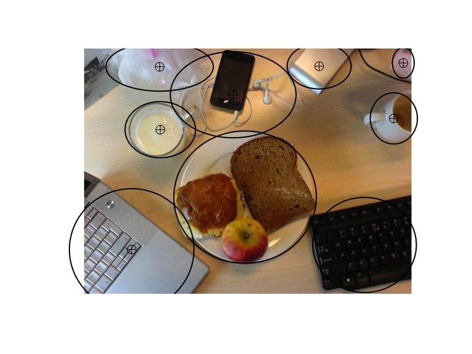
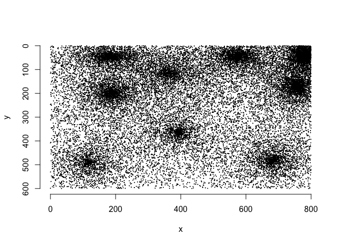
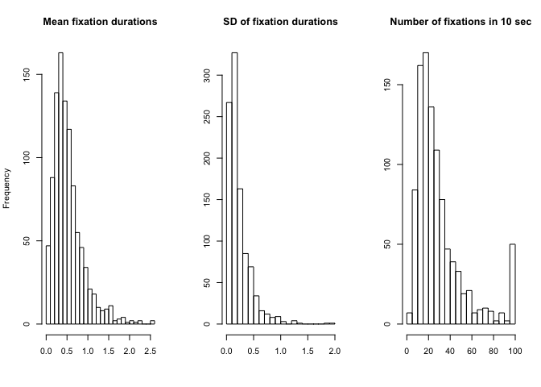

Object oriented behavior
================
Simon Kucharsky
2020-04-15

This example demonstrates the implementation of a dynamic model of eye
movements that assumes that only objects on the scene influence the eye
movement behavior.

We will demonstrate this example on one stimulus from the article by Xu
et al. (2014). Specifically, we use the following image 1001.jpg
available from their [public
repository](https://github.com/NUS-VIP/predicting-human-gaze-beyond-pixels):

<!-- -->

The ellipses demarkate objects on the scene (based on their specified
widths and heights).

## Model specification

Recall that we have a model for the fixation locations, specified as
follows:

\[
\lambda(x, y) = \sum_{k=1}^K \pi_k \times \text{Normal}(x | \mu_{kx}, \sigma_{kx}) \times \text{Normal}(y | \mu_{ky}, \sigma_{ky}).
\] Here our ‘factors’ will be the objects on the scene. We know the
locations of the objects, and so we set the means \(\mu\) to the centers
of the objects. However, the objects can have varying size. To account
the sizes of the objects, we could technically estimate the individual
\(\sigma\)’s, but we can also use the fact that we have a data set that
demarkates the width (\(w\)) and height (\(h\)) of the objects, and use
a single parameter \(\delta\) that stretches all the dimensions of the
objects equally. The model for fixation locations is then

\[
\lambda(x, y) = \sum_{k=1}^K \pi_k \times \text{Normal}(x | m_{kx}, \delta w_{kx}/2) \times \text{Normal}(y | m_{ky}, \delta h_{ky}/2).
\] Our model for fixation duration is

\[
d^t \sim \text{Wald}(\alpha, \nu^t) \\
\nu^t = -\log \int \int a(x, y | s^t) \lambda(x, y) dx dy,
\] where \(s^t\) is the current fixation location.

## Implementation in Stan

The model can be translated in the Stan code as
following

``` r
writeLines(readLines(here::here("stan", "examples", "object_oriented_behavior.stan")))
```

    ## functions{
    ## #include helpers/wald_lpdf.stan  
    ## }
    ## data{
    ##   int<lower=1> N_obs; // number of observations
    ##   real x[N_obs]; // x-coordinates of fixations
    ##   real y[N_obs]; // y coordinates of fixations
    ##   real duration[N_obs]; // fixation durations
    ##   
    ##   int<lower=1> N_objects; // number of objects on a scene
    ##   vector[N_objects] objects_center_x; // x-coordinates of object centers
    ##   vector[N_objects] objects_center_y; // y-coordinates of object centers
    ##   vector[N_objects] objects_widht; // object widths
    ##   vector[N_objects] objects_height; // object heights
    ## }
    ## transformed data{
    ##   vector[N_objects] objects_widht_2 = objects_widht / 2; // object radii in x-coordinate
    ##   vector[N_objects] objects_height_2 = objects_height / 2; // object radii in y-coordinate
    ## }
    ## parameters{
    ##   simplex[N_objects] weights; // importance of different objects
    ##   real<lower=0> alpha; // decision boundary
    ##   real<lower=0> delta; // scaling of the objects
    ##   real<lower=0> sigma_attention; // width of attention window
    ## }
    ## transformed parameters{
    ##   vector[N_objects] sigma_x = delta * objects_widht_2;
    ##   vector[N_objects] sigma_y = delta * objects_height_2;
    ## }
    ## model{
    ##   for(t in 1:N_obs){
    ##     // compute drift rate at the specific location
    ##     real nu = -log_integral_attention_mixture_2d(x[t], y[t], weights, objects_center_x, sigma_x, objects_center_y, sigma_y, sigma_attention, sigma_attention);
    ##     // model for fixation locations
    ##     target += mixture_normals(x[t], y[t], weights, objects_center_x, sigma_x, objects_center_y, sigma_y);
    ##     // model for fixation durations
    ##     duration[t] ~ wald(alpha, nu);
    ##   }
    ##   
    ##   # priors
    ##   alpha ~ normal(2, 1);
    ##   sigma_attention ~ gamma(2, 0.1);
    ##   delta ~ exp(1);
    ##   weigths ~ dirichlet(rep_vector(2, N_objects));
    ## }

``` r
#model <- rstan::stan_model(here::here("stan", "examples", "object_oriented_behavior.stan"))
```

## Prior Predictives

We created the model with the following priors:

\[
\begin{aligned}
\pi & \sim \text{Symmetric-Dirichlet}(2) \\
\delta & \sim \text{Exponential}(1) \\
\alpha & \sim \text{Normal}(2, 1)_{[0,\infty)} \\
\sigma_a & \sim \text{Gamma}(2, 0.1)
\end{aligned}
\]

We simulate 1000 data sets:

1)  draw parameters based on their priors
2)  draw 10 seconds of data or at most 100 fixations for a given set of
    drawn parameters

Below is what the model in combination with the priors predicts about
the locations of
fixations:

``` r
plot(sim_data$x, sim_data$y, pch = 19, cex = 0.1, xlab = "x", ylab = "y", bty = "n", ylim = rev(range(sim_data$y)))
```

<!-- -->

And below are the summaries of the distributions of fixation durations

``` r
par(mfrow = c(1, 3))
hist(sapply(sim_data_list, function(x) mean(x$duration)), breaks = n_sim / 50, main = "Mean fixation durations", xlab = "")
hist(sapply(sim_data_list, function(x) sd(x$duration)),   breaks = n_sim / 50, main = "SD of fixation durations", xlab = "", ylab = "")
hist(sapply(sim_data_list, nrow), breaks = n_sim / 50, main = sprintf("Number of fixations in %s sec", t_max), xlab = "", ylab = "")
```

<!-- -->

## Computational faithfulness

We fit the model on all 1000 simulated datasets.

## References

<div id="refs" class="references">

<div id="ref-Xu2014beyond">

Xu, J., Jiang, M., Wang, S., Kankanhalli, M. S., & Zhao, Q. (2014).
Predicting human gaze beyond pixels. *Journal of Vision*, *14*(1),
28–28. <https://doi.org/10.1167/14.1.28>

</div>

</div>
