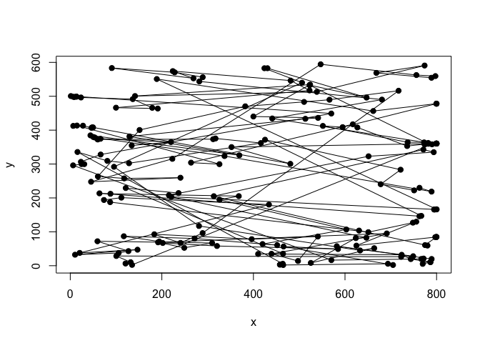

Direction bias
================
Simon Kucharsky
2020-07-01

This file validates the implementation of the direction bias (see
`stan/helpers/direction_bias_lpdf.stan`).

``` r
library(rstan)
```

    ## Loading required package: StanHeaders

    ## Loading required package: ggplot2

    ## rstan (Version 2.19.3, GitRev: 2e1f913d3ca3)

    ## For execution on a local, multicore CPU with excess RAM we recommend calling
    ## options(mc.cores = parallel::detectCores()).
    ## To avoid recompilation of unchanged Stan programs, we recommend calling
    ## rstan_options(auto_write = TRUE)

``` r
source(here::here("R", "expose_helpers_stan.R"))
```

## Fitting a mixture of von Mises distributions

The following code checks that the density function of the von Mises
mixture is implemented correctly. Here, we simulate data from two
mixture components with means fixed to 0 and
, equal
concentrations , and equal mixture weights.

``` r
mvonmises <- function(x, weights, mu, kappa){
  lpdf <- sapply(x, function(a) mixture_von_mises_lpdf(a, weights, mu, kappa))
  
  exp(lpdf)
}

theta <- vector(length = 200)
for(i in 1:200) theta[i] <- mixture_von_mises_rng(c(0.5, 0.5), c(0, pi), c(8, 8))
hist(theta, breaks = seq(-pi, pi, length.out = 50), freq = FALSE, main = "von Mises mixture")
curve(mvonmises(x = x, weights = c(0.5, 0.5), mu = c(0, pi), kappa = c(8, 8)), from = -pi, to = pi, add = TRUE)
```

<!-- -->

Below we fit the model to see whether we recover the parameter
. The
model is relatively simple, utilizing the `mixture_von_mises_lpdf`
helper function:

``` r
writeLines(readLines(here::here("stan", "examples", "mixture_von_mises_single.stan")))
```

    ## functions{
    ## #include stan/helpers/load_functions.stan
    ## }
    ## data{
    ##   int<lower=1> N_obs;
    ##   real angle[N_obs];
    ##   vector[2] mu_angle;
    ## }
    ## 
    ## parameters{
    ##   real<lower=0> kappa; 
    ## }
    ## model{
    ##   for(i in 1:N_obs) {
    ##     target += mixture_von_mises_lpdf(angle[i] | rep_vector(1.0/2.0, 2), mu_angle, rep_vector(kappa, 2));
    ##   }
    ##   
    ##   kappa ~ gamma(10, 1);
    ## }

The code below fits the model (estimates the parameter
):

``` r
stan_model <- rstan::stan_model(here::here("stan", "examples", "mixture_von_mises_single.stan"),
                                isystem = here::here(), verbose=FALSE)

stan_data  <- list(N_obs = length(theta), angle = theta, mu_angle = c(0, pi))

stan_fit   <- rstan::sampling(stan_model, stan_data, chains = 4, cores = 4, warmup = 500, iter = 1000, refresh = 0)

stan_fit
```

    ## Inference for Stan model: mixture_von_mises_single.
    ## 4 chains, each with iter=1000; warmup=500; thin=1; 
    ## post-warmup draws per chain=500, total post-warmup draws=2000.
    ## 
    ##          mean se_mean   sd    2.5%     25%     50%     75%   97.5% n_eff Rhat
    ## kappa    7.48    0.02 0.67    6.23    7.03    7.43    7.89    8.86   740    1
    ## lp__  -219.38    0.02 0.71 -221.34 -219.53 -219.10 -218.95 -218.90  1007    1
    ## 
    ## Samples were drawn using NUTS(diag_e) at Wed Jul  1 17:15:05 2020.
    ## For each parameter, n_eff is a crude measure of effective sample size,
    ## and Rhat is the potential scale reduction factor on split chains (at 
    ## convergence, Rhat=1).

And it seems that we were sucessfull in estimating the parameter.

## Fitting a direction bias

Here, we check whether we can fit a direction bias model. Specifically,
in here, we are not specifying the model for fixation durations, as we
do not expect that direction bias (such as horizontal bias) would have
any impact on it.

First, we will simulate single data following this initial setup:

1)  The screen has dimensions `800` pixels in horizontal direction and
    `600` pixels in vertical direction.

2)  The first fixation is not random and thus fixed to the center of the
    screen (`x = 400`, `y = 300`)

And the following data generative meachanism of each successive
fixation:

1)  We draw an angle between 0 and
     from a
    specified mixture of von Mises distributions.

2)  Draw a line going through the current fixation under the angle drawn
    in 1).

3)  Calculate the distance between the current fixation and the border
    of the screen (along the drawn line).

4)  Draw a random number according to Uniform distribution between 0 and
    the number calculated in 3).

5)  The angle drawn in 1) and the number drawn in 4) together specify
    the saccade, which determine the displacement ofo the current
    fixation to the previous fixation.

The code below simulates and plots the data.

``` r
xy <- matrix(NA, nrow = 200, ncol = 2)

for(i in 1:nrow(xy)){
  x <- ifelse(i == 1, 400, xy[i-1, 1])
  y <- ifelse(i == 1, 300, xy[i-1, 2])
  xy[i,] <- direction_bias_rng(c(0.5, 0.5), c(0, pi), c(8, 8), x, y, 0, 800, 0, 600)
}

plot(xy, pch = 19, xlab = "x", ylab = "y")
lines(xy)
```

<!-- -->

Here, we fit the model to the data. The model is more complex than the
one above, since it needs to calculate additional information from the
data. Specifically, in the `transformed data` block, we calculate the
saccade `angle` from the x and y coordinates of fixations, the saccade
lengths (in this script called the `radius`), and the distance to the
edge of the screen given the `angle` of the saccade and the x and y
coordinates of the outgoing fixation location. These variables are
needed to calculate to get the proper density `direction_bias_lpdf()` of
the random variables `saccade = (angle, lenght)`, where we assume that
`angle` is distributed according to a mixture of von Mises, and `length`
(radius) is distributed uniformly between the current location and the
edge of the screen.

``` r
writeLines(readLines(here::here("stan", "examples", "direction_bias_single.stan")))
```

    ## functions{
    ## #include stan/helpers/load_functions.stan
    ## }
    ## data{
    ##   int<lower=1> N_obs;
    ##   real x[N_obs]; // x position of fixation
    ##   real y[N_obs]; // y position of fixation
    ## }
    ## transformed data{
    ##   real<lower=-pi(),upper=pi()> angle[N_obs];
    ##   real<lower=0> radius[N_obs];
    ##   real<lower=0> dist_to_border[N_obs];
    ##   vector[3] res[N_obs]; // [angle, radius, distance to border]
    ##   real x_prev[N_obs];
    ##   real y_prev[N_obs];
    ##   vector[2] mu_angle;
    ##   mu_angle[1] = 0;
    ##   mu_angle[2] = pi();
    ##   
    ##   for(i in 1:N_obs){
    ##     // coordinates of 'previous fixations'
    ##     
    ##     if(i == 1){
    ##     // if it's a first fixation, calculate angle relative to center
    ##       x_prev[i] = 400;
    ##       y_prev[i] = 300;
    ##     } else{
    ##     // otherwise calculate angle relative to the previous fixation  
    ##       x_prev[i] = x[i-1];
    ##       y_prev[i] = y[i-1];
    ##     }
    ##     
    ##     res[i] = calc_angle_border(x[i], y[i], x_prev[i], y_prev[i], 0, 800, 0, 600);
    ##     angle[i]          = res[i][1];
    ##     radius[i]         = res[i][2];
    ##     dist_to_border[i] = res[i][3];
    ##   }
    ## }
    ## parameters{
    ##   real<lower=0> kappa; 
    ## }
    ## model{
    ##   for(i in 1:N_obs) {
    ##     target += direction_bias_lpdf(angle[i] | radius[i], dist_to_border[i], rep_vector(1.0/2.0, 2), mu_angle, rep_vector(kappa, 2));
    ##     //target += mixture_von_mises_lpdf(angle[i] | rep_vector(1.0/2.0, 2), mu_angle, rep_vector(kappa, 2));
    ##   }
    ##   
    ##   kappa ~ gamma(10, 1);
    ## }

The code below fits the model to estimate the parameter
 (=
8),

``` r
stan_model <- rstan::stan_model(here::here("stan", "examples", "direction_bias_single.stan"),
                                isystem = here::here(), verbose = FALSE)

stan_data  <- list(N_obs = nrow(xy), x = xy[,1], y = xy[,2])

stan_fit   <- rstan::sampling(stan_model, stan_data, chains = 4, cores = 4, warmup = 500, iter = 1000, refresh = 0)

print(stan_fit)
```

    ## Inference for Stan model: direction_bias_single.
    ## 4 chains, each with iter=1000; warmup=500; thin=1; 
    ## post-warmup draws per chain=500, total post-warmup draws=2000.
    ## 
    ##           mean se_mean   sd     2.5%      25%      50%      75%    97.5% n_eff
    ## kappa     9.13    0.03 0.85     7.53     8.56     9.14     9.65    10.92   725
    ## lp__  -1956.14    0.02 0.74 -1958.32 -1956.30 -1955.85 -1955.69 -1955.64   909
    ##       Rhat
    ## kappa 1.01
    ## lp__  1.00
    ## 
    ## Samples were drawn using NUTS(diag_e) at Wed Jul  1 17:16:23 2020.
    ## For each parameter, n_eff is a crude measure of effective sample size,
    ## and Rhat is the potential scale reduction factor on split chains (at 
    ## convergence, Rhat=1).

which seems to work.
