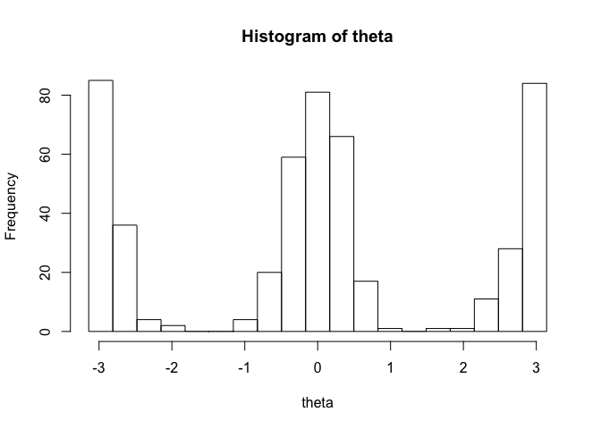

Direction bias
================
Simon Kucharsky
2020-05-25

This file validates the implementation of the direction bias (see
`stan/helpers/direction_bias_lpdf.stan`).

First, we will simulate single data following this initial setup:

1)  The screen has dimensions `800` pixels in horizontal direction and
    `600` pixels in vertical direction.

2)  The first fixation is not random and fixed to the center of the
    screen (`x = 400`, `y = 300`)

And the following data generative meachanism of each successive
fixation:

1)  We draw an angle between 0 and
     from a
    specified mixture of von Mises distributions.

2)  Draw a line going through the current fixation under the angle drawn
    in 1).

3)  Calculate the distance between the current fixation and the border
    of the screen (along the drawn line).

4)  Draw a random number according to Uniform distribution between 0 and
    the number calculated in 3).

5)  The angle drawn in 1) and the number drawn in 4) together specify
    the saccade, which determine the displacement ofo the current
    fixation to the previous fixation.

<!-- end list -->

``` r
library(rstan)
```

    ## Loading required package: StanHeaders

    ## Loading required package: ggplot2

    ## rstan (Version 2.19.3, GitRev: 2e1f913d3ca3)

    ## For execution on a local, multicore CPU with excess RAM we recommend calling
    ## options(mc.cores = parallel::detectCores()).
    ## To avoid recompilation of unchanged Stan programs, we recommend calling
    ## rstan_options(auto_write = TRUE)

``` r
source(here::here("R", "expose_helpers_stan.R"))
```

    ## Warning in readLines(here::here("stan", "helpers", p)): incomplete final
    ## line found on '/Users/skuchar/Projects/EyeTracking/DMEM/stan/helpers/
    ## saliency_rng.stan'

    ## Warning in readLines(here::here("stan", "helpers", p)): incomplete final
    ## line found on '/Users/skuchar/Projects/EyeTracking/DMEM/stan/helpers/
    ## calc_angle_border.stan'

    ## Warning in readLines(here::here("stan", "helpers", p)): incomplete final
    ## line found on '/Users/skuchar/Projects/EyeTracking/DMEM/stan/helpers/
    ## direction_bias_lpdf.stan'

    ## Warning in readLines(here::here("stan", "helpers", p)): incomplete final
    ## line found on '/Users/skuchar/Projects/EyeTracking/DMEM/stan/helpers/
    ## direction_bias_rng.stan'

``` r
theta <- vector(length = 100)
for(i in 1:100) theta[i] <- mixture_von_mises_rng(c(0.5, 0.5), c(0, pi), c(8, 8))
hist(theta)
```

<!-- -->
