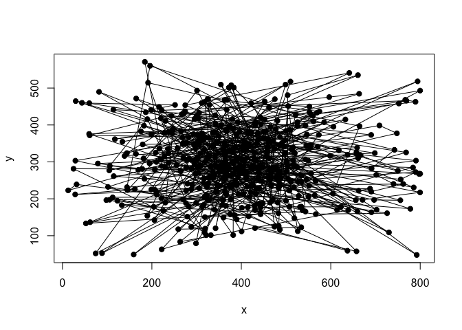

Direction bias and Central bias
================
Simon Kucharsky
2020-05-25

``` r
library(rstan)
```

    ## Loading required package: StanHeaders

    ## Loading required package: ggplot2

    ## rstan (Version 2.19.3, GitRev: 2e1f913d3ca3)

    ## For execution on a local, multicore CPU with excess RAM we recommend calling
    ## options(mc.cores = parallel::detectCores()).
    ## To avoid recompilation of unchanged Stan programs, we recommend calling
    ## rstan_options(auto_write = TRUE)

``` r
source(here::here("R", "expose_helpers_stan.R"))
```

    ## Warning in readLines(here::here("stan", "helpers", p)): incomplete final
    ## line found on '/Users/skuchar/Projects/EyeTracking/DMEM/stan/helpers/
    ## saliency_rng.stan'

    ## Warning in readLines(here::here("stan", "helpers", p)): incomplete final
    ## line found on '/Users/skuchar/Projects/EyeTracking/DMEM/stan/helpers/
    ## calc_angle_border.stan'

    ## Warning in readLines(here::here("stan", "helpers", p)): incomplete final
    ## line found on '/Users/skuchar/Projects/EyeTracking/DMEM/stan/helpers/
    ## direction_bias_lpdf.stan'

    ## Warning in readLines(here::here("stan", "helpers", p)): incomplete final
    ## line found on '/Users/skuchar/Projects/EyeTracking/DMEM/stan/helpers/
    ## direction_bias_rng.stan'

    ## Trying to compile a simple C file

    ## Running /Library/Frameworks/R.framework/Resources/bin/R CMD SHLIB foo.c
    ## clang -I"/Library/Frameworks/R.framework/Resources/include" -DNDEBUG   -I"/Library/Frameworks/R.framework/Versions/3.6/Resources/library/Rcpp/include/"  -I"/Library/Frameworks/R.framework/Versions/3.6/Resources/library/RcppEigen/include/"  -I"/Library/Frameworks/R.framework/Versions/3.6/Resources/library/RcppEigen/include/unsupported"  -I"/Library/Frameworks/R.framework/Versions/3.6/Resources/library/BH/include" -I"/Library/Frameworks/R.framework/Versions/3.6/Resources/library/StanHeaders/include/src/"  -I"/Library/Frameworks/R.framework/Versions/3.6/Resources/library/StanHeaders/include/"  -I"/Library/Frameworks/R.framework/Versions/3.6/Resources/library/rstan/include" -DEIGEN_NO_DEBUG  -D_REENTRANT  -DBOOST_DISABLE_ASSERTS -DBOOST_PENDING_INTEGER_LOG2_HPP -include stan/math/prim/mat/fun/Eigen.hpp   -isysroot /Library/Developer/CommandLineTools/SDKs/MacOSX.sdk -I/usr/local/include  -fPIC  -isysroot /Library/Developer/CommandLineTools/SDKs/MacOSX.sdk -c foo.c -o foo.o
    ## In file included from <built-in>:1:
    ## In file included from /Library/Frameworks/R.framework/Versions/3.6/Resources/library/StanHeaders/include/stan/math/prim/mat/fun/Eigen.hpp:13:
    ## In file included from /Library/Frameworks/R.framework/Versions/3.6/Resources/library/RcppEigen/include/Eigen/Dense:1:
    ## In file included from /Library/Frameworks/R.framework/Versions/3.6/Resources/library/RcppEigen/include/Eigen/Core:88:
    ## /Library/Frameworks/R.framework/Versions/3.6/Resources/library/RcppEigen/include/Eigen/src/Core/util/Macros.h:613:1: error: unknown type name 'namespace'
    ## namespace Eigen {
    ## ^
    ## /Library/Frameworks/R.framework/Versions/3.6/Resources/library/RcppEigen/include/Eigen/src/Core/util/Macros.h:613:16: error: expected ';' after top level declarator
    ## namespace Eigen {
    ##                ^
    ##                ;
    ## In file included from <built-in>:1:
    ## In file included from /Library/Frameworks/R.framework/Versions/3.6/Resources/library/StanHeaders/include/stan/math/prim/mat/fun/Eigen.hpp:13:
    ## In file included from /Library/Frameworks/R.framework/Versions/3.6/Resources/library/RcppEigen/include/Eigen/Dense:1:
    ## /Library/Frameworks/R.framework/Versions/3.6/Resources/library/RcppEigen/include/Eigen/Core:96:10: fatal error: 'complex' file not found
    ## #include <complex>
    ##          ^~~~~~~~~
    ## 3 errors generated.
    ## make: *** [foo.o] Error 1

## Fitting a direction bias

``` r
dir_weigths <- c(0.5, 0.5)
dir_mu      <- c(0, pi)
dir_kappa   <- c(8, 8)

cen_sigma   <- c(100, 100)
mix_weights <- c(0.4, 0.6)

xy <- matrix(NA, nrow = 500, ncol = 2)
for(i in 1:nrow(xy)){
  k <- sample(1:2, 1, TRUE, mix_weights)
  
  if(k == 1){
    x <- ifelse(i == 1, 400, xy[i-1, 1])
    y <- ifelse(i == 1, 300, xy[i-1, 2])
    xy[i,] <- direction_bias_rng(c(0.5, 0.5), c(0, pi), c(8, 8), x, y, 0, 800, 0, 600)
  } else {
    xy[i,1] <- trunc_normal_rng(400, cen_sigma[1], 0, 800)
    xy[i,2] <- trunc_normal_rng(300, cen_sigma[2], 0, 600)
  }
}

plot(xy, pch = 19, xlab = "x", ylab = "y")
lines(xy)
```

<!-- -->

``` r
stan_model <- rstan::stan_model(here::here("stan", "examples", "direction_central_bias_single.stan"), isystem = here::here())
```

    ## Trying to compile a simple C file

    ## Running /Library/Frameworks/R.framework/Resources/bin/R CMD SHLIB foo.c
    ## clang -I"/Library/Frameworks/R.framework/Resources/include" -DNDEBUG   -I"/Library/Frameworks/R.framework/Versions/3.6/Resources/library/Rcpp/include/"  -I"/Library/Frameworks/R.framework/Versions/3.6/Resources/library/RcppEigen/include/"  -I"/Library/Frameworks/R.framework/Versions/3.6/Resources/library/RcppEigen/include/unsupported"  -I"/Library/Frameworks/R.framework/Versions/3.6/Resources/library/BH/include" -I"/Library/Frameworks/R.framework/Versions/3.6/Resources/library/StanHeaders/include/src/"  -I"/Library/Frameworks/R.framework/Versions/3.6/Resources/library/StanHeaders/include/"  -I"/Library/Frameworks/R.framework/Versions/3.6/Resources/library/rstan/include" -DEIGEN_NO_DEBUG  -D_REENTRANT  -DBOOST_DISABLE_ASSERTS -DBOOST_PENDING_INTEGER_LOG2_HPP -include stan/math/prim/mat/fun/Eigen.hpp   -isysroot /Library/Developer/CommandLineTools/SDKs/MacOSX.sdk -I/usr/local/include  -fPIC  -isysroot /Library/Developer/CommandLineTools/SDKs/MacOSX.sdk -c foo.c -o foo.o
    ## In file included from <built-in>:1:
    ## In file included from /Library/Frameworks/R.framework/Versions/3.6/Resources/library/StanHeaders/include/stan/math/prim/mat/fun/Eigen.hpp:13:
    ## In file included from /Library/Frameworks/R.framework/Versions/3.6/Resources/library/RcppEigen/include/Eigen/Dense:1:
    ## In file included from /Library/Frameworks/R.framework/Versions/3.6/Resources/library/RcppEigen/include/Eigen/Core:88:
    ## /Library/Frameworks/R.framework/Versions/3.6/Resources/library/RcppEigen/include/Eigen/src/Core/util/Macros.h:613:1: error: unknown type name 'namespace'
    ## namespace Eigen {
    ## ^
    ## /Library/Frameworks/R.framework/Versions/3.6/Resources/library/RcppEigen/include/Eigen/src/Core/util/Macros.h:613:16: error: expected ';' after top level declarator
    ## namespace Eigen {
    ##                ^
    ##                ;
    ## In file included from <built-in>:1:
    ## In file included from /Library/Frameworks/R.framework/Versions/3.6/Resources/library/StanHeaders/include/stan/math/prim/mat/fun/Eigen.hpp:13:
    ## In file included from /Library/Frameworks/R.framework/Versions/3.6/Resources/library/RcppEigen/include/Eigen/Dense:1:
    ## /Library/Frameworks/R.framework/Versions/3.6/Resources/library/RcppEigen/include/Eigen/Core:96:10: fatal error: 'complex' file not found
    ## #include <complex>
    ##          ^~~~~~~~~
    ## 3 errors generated.
    ## make: *** [foo.o] Error 1

``` r
stan_data  <- list(N_obs = nrow(xy), x = xy[,1], y = xy[,2])

stan_fit   <- rstan::sampling(stan_model, stan_data, chains = 4, cores = 4, warmup = 500, iter = 1000, refresh = 250)

print(stan_fit)
```

    ## Inference for Stan model: direction_central_bias_single.
    ## 4 chains, each with iter=1000; warmup=500; thin=1; 
    ## post-warmup draws per chain=500, total post-warmup draws=2000.
    ## 
    ##                mean se_mean   sd     2.5%      25%      50%      75%    97.5%
    ## kappa          8.99    0.03 1.17     6.93     8.13     8.94     9.74    11.45
    ## sigma         95.09    0.08 3.24    88.95    92.88    94.99    97.27   101.68
    ## weights[1]     0.36    0.00 0.03     0.31     0.34     0.36     0.38     0.42
    ## weights[2]     0.64    0.00 0.03     0.58     0.62     0.64     0.66     0.69
    ## lp__       -6097.12    0.04 1.16 -6099.91 -6097.64 -6096.82 -6096.27 -6095.78
    ##            n_eff Rhat
    ## kappa       1683    1
    ## sigma       1847    1
    ## weights[1]  1438    1
    ## weights[2]  1438    1
    ## lp__         934    1
    ## 
    ## Samples were drawn using NUTS(diag_e) at Mon May 25 19:21:17 2020.
    ## For each parameter, n_eff is a crude measure of effective sample size,
    ## and Rhat is the potential scale reduction factor on split chains (at 
    ## convergence, Rhat=1).
