Initial Model
================
Simon Kucharsky
2020-10-19

Here, we will provide some more information about the initial model
reported in the article. Specifically, here we explain the basic of the
model’s architecture, and describe additional information.

## The model

The model contains four factors (components), of which two are included
in the model for *when.* The factors are the following:

1.  Objects in the scene (included in the model for when)
2.  Saliency of the images (included in the model for when)
3.  Exploitation
4.  Central bias

## Simulation

We conducted a small parameter recovery simulation to assess the model’s
performance.

The simulation is based on six images from the real data set. Below are
the pictures with their downsampled saliency maps and highlighted the
centers and sizes of labelled objects on the scene.

``` r
par(mfrow = c(1, 2))
for(i in seq_along(image_name)) {
  img <- load_image(image_name[i])
  dim_img <- list(min_x = 0, min_y = 0, max_x = imager::width(img), max_y = imager::height(img))
  obj <- subset(objects, image == image_nr[i])
  sal <- subset(saliency, image == image_nr[i])
  
  plot(img, axes = FALSE)
  points(obj$x, obj$y, pch = 10, cex = 2)
   for(i in 1:nrow(obj))
     plotrix::draw.ellipse(x = obj$x[i], y = obj$y[i], a = obj$width[i]/2, b = obj$height[i]/2, angle = 0, lwd = 2)
  
  plot(imager::as.cimg(sal$value, x = max(sal$row), y = max(sal$col)), axes = FALSE)
}
```

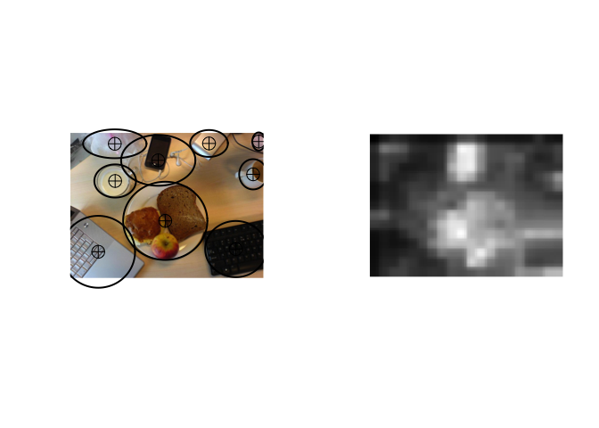<!-- -->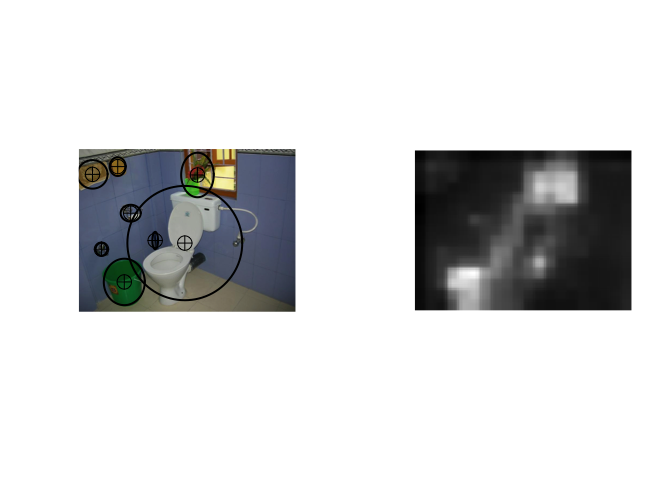<!-- -->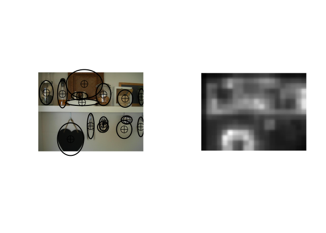<!-- -->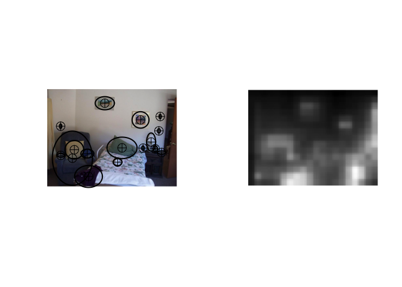<!-- -->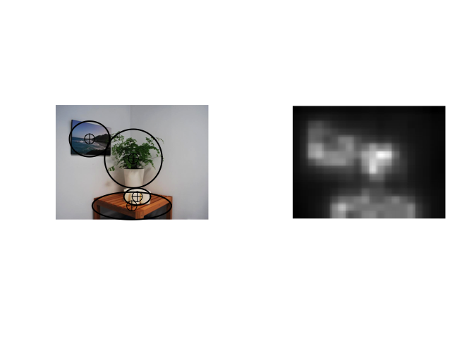<!-- -->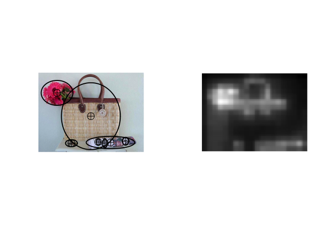<!-- -->

``` r
par(mfrow = c(1, 1))
```

``` r
# draw from priors
N_sim <- 20
N_ppt <- 25
N_obj <- nrow(objects)

load(here::here("documents", "initial_model_saves", "true.Rdata"))
load(here::here("documents", "initial_model_saves", "sim_data.Rdata"))
load(here::here("documents", "initial_model_saves", "fits.Rdata"))
```

``` r
get_par <- function(par, true) {
  fit_summary <- t(sapply(fits, function(fit) summary(fit, pars = par)$summary[, c("mean", "25%", "75%"), drop=TRUE]))
  fit_summary <- as.data.frame(fit_summary)
  fit_summary$true <- true[, par]
  
  fit_summary
}

plot_par <- function(par, true) {
  df <- get_par(par, true)
  lim <- range(as.matrix(df))
  plot(df$true, df$mean, pch = 19, cex = 1, main = par, 
       xlab = "True", ylab = "Estimated", 
       xlim = lim, ylim = lim)
  segments(x0 = df$true, y0 = df$`25%`, y1 = df$`75%`)
  abline(a = 0, b = 1)
}

get_vec_par <- function(par, true) {
  fit_summary <- lapply(seq_along(fits), function(i) { 
    fit <- fits[[i]]
    out <- summary(fit, pars = par)$summary[, c("mean", "25%", "75%"), drop=TRUE]
    out <- as.data.frame(out)
    out$true <- unlist(true[i,,drop=TRUE])
    out$sim <- i
    colnames(out) <- c("est", "lower", "upper", "true", "sim")
    out
  })
  #fit_summary <- as.data.frame(fit_summary)
  
  do.call(rbind, fit_summary)
}

plot_vec_par <- function(par, true) {
  df <- get_vec_par(par, true)
  
  ggplot(df, aes(x=true, y=est, ymin=lower, ymax=upper, col=as.factor(sim))) + 
    geom_abline(intercept = 0, slope = 1) +
    geom_point() +
    geom_errorbar()
}

par(mfrow=c(2, 4))
for(par in colnames(true_parameters)) {
  plot_par(par, true_parameters)
}

par(mfrow=c(1, 4))
```

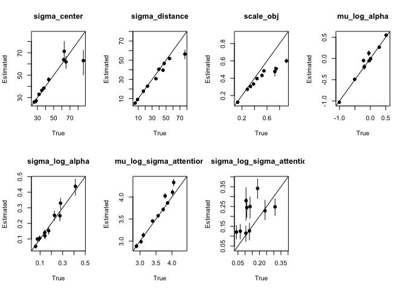<!-- -->

``` r
for(par in colnames(true_weights)) {
  plot_par(par, true_weights)
}
```

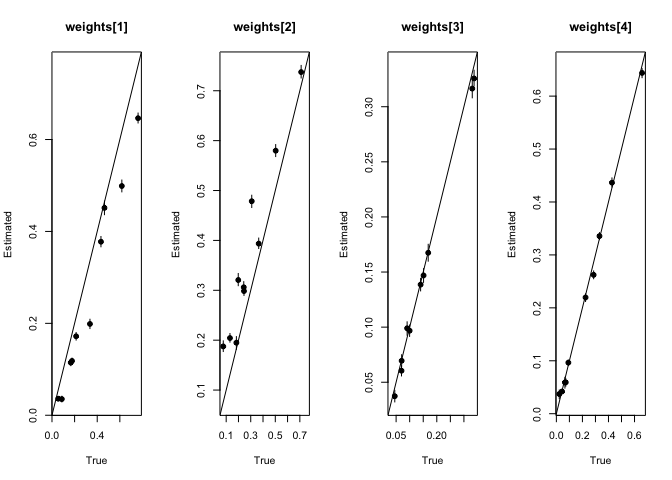<!-- -->

``` r
plot_vec_par("z_weights_obj", true_z_weights_obj)
```

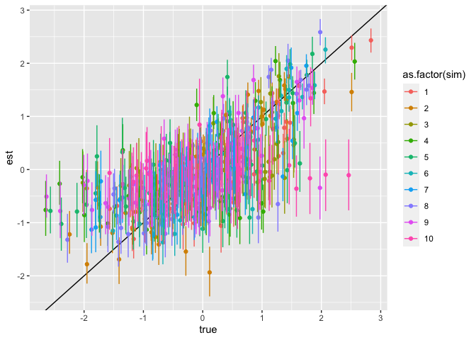<!-- -->

``` r
plot_vec_par("alpha", true_alpha)
```

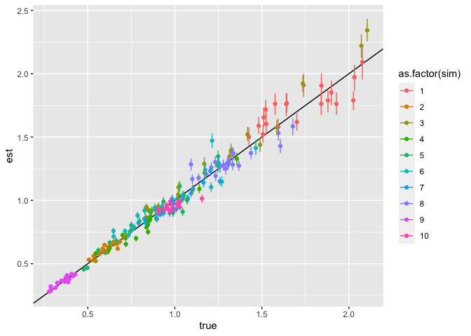<!-- -->

``` r
plot_vec_par("sigma_attention", true_sigma_attention)
```

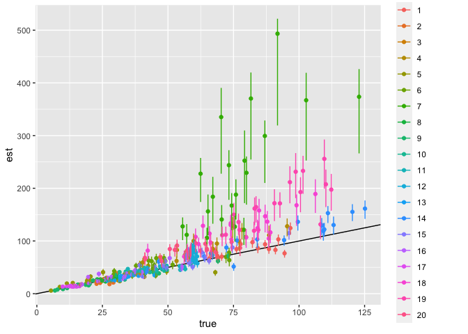<!-- -->
