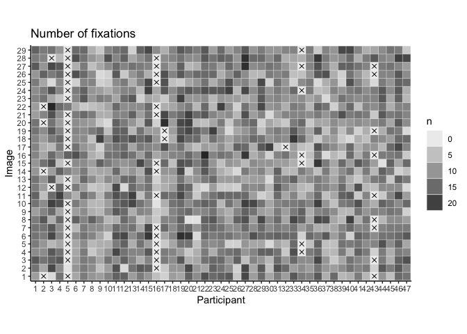
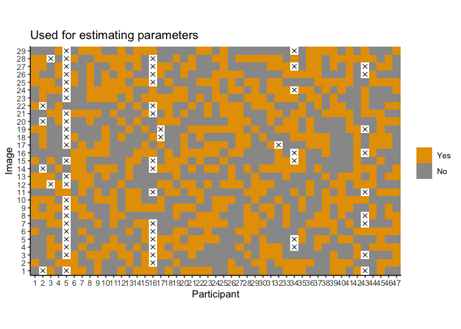
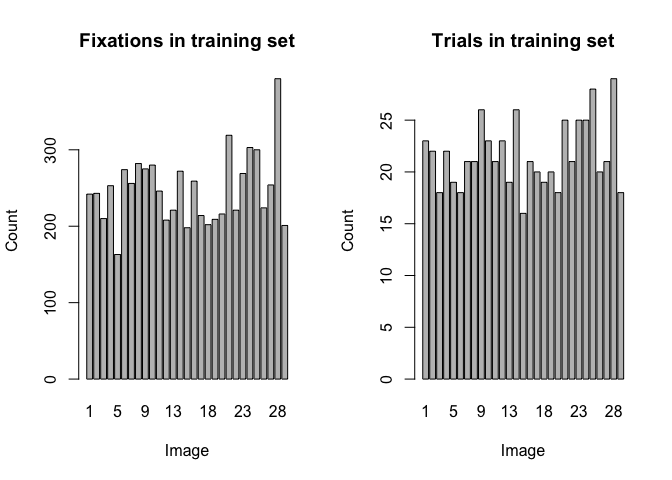
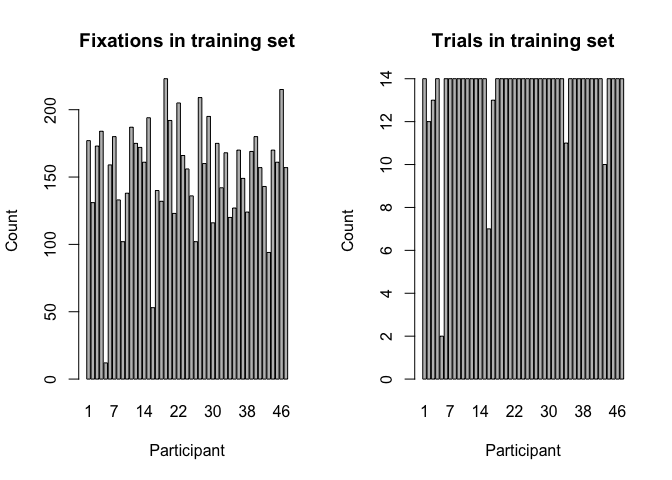

Data Preparation
================
Simon Kucharsky
2020-04-20

## Eye movement data

The eye movement data comes from
(<span class="citeproc-not-found" data-reference-id="Renswoude">**???**</span>),
and is based on the stimulus materials provided in Xu et al. (2014).

First, we clean the data and prepare relevant indexes (i.e., id of
participants need to be recoded from factors to integers for Stan).

``` r
library(tidyverse)
library(imager)
library(here)
source(here::here("R", "load_image.R"))
ggplot2::theme_set(ggplot2::theme_classic())
# load data
df <- read.csv(here::here("data", "object_familiarity", "Fixations_all.csv"), sep = ";", dec = ",")

# get relevant variables
df_clean <- dplyr::select(df, PP, Trial, Order, image, mean_x, mean_y, Duration)
names(df_clean) <- c("ppt", "trial", "order", "image", "x", "y", "duration (ms)")

# convert duration from ms to sec
df_clean$duration <- df_clean[['duration (ms)']]/1000

# convert indexes to integers
df_clean$id_ppt <- as.integer(df_clean$ppt)
df_clean$id_img <- as.integer(as.factor(df_clean$image))

# arrange by ppt, img, and order of fixations
df_clean <- dplyr::arrange(df_clean, id_ppt, id_img, order)

# reorder variables
df_clean <- dplyr::select(df_clean, id_ppt, id_img, order, ppt, image, trial, x, y, duration)

# save
readr::write_csv(df_clean, path = here::here("data", "object_familiarity", "fixations.csv"))
rm(df, df_clean)
# load again (check whether it can be loaded correctly)
df <- readr::read_csv(file = here::here("data", "object_familiarity", "fixations.csv"))
```

Here, we assign each trial into a sample which is used for model
fitting, or model validation. We want to have some data for each
participant, and some data for each image, in each of the samples.

``` r
n_fixations <- df %>% 
  dplyr::group_by(id_ppt, id_img) %>%
  dplyr::summarise(n = dplyr::n()) %>%
  dplyr::ungroup() %>%
  tidyr::complete(id_ppt, id_img, fill = list(n = 0)) %>%
  dplyr::mutate(is_na = n == 0, is_not_na = n != 0)

n_fixations %>%
  ggplot2::ggplot(ggplot2::aes(x = as.factor(id_ppt), y = as.factor(id_img), alpha = n)) + 
  ggplot2::geom_tile(color = "white") +
  ggplot2::geom_point(data = n_fixations %>% subset(is_na), ggplot2::aes(x = id_ppt, y = id_img), shape = 4, size = 2, alpha = 1) + 
  ggplot2::coord_equal() + 
  ggplot2::xlab("Participant") + 
  ggplot2::ylab("Image") + 
  ggplot2::ggtitle("Number of fixations") 
```



First, we see that some participants (5, 16) have less than half of the
trials, and so we will group the data by participants, and split each
subset on two roughly equal in the number of trials.

``` r
set.seed(2020)
df %<>% plyr::ddply(.variables = "id_ppt", .fun = function(d){
  img   <- unique(d$id_img)
  n_img <- length(img)
  n_train <- floor(n_img / 2)
  train <- sample(x = c(rep(TRUE, n_train), rep(FALSE, n_img - n_train)), size = n_img, replace = FALSE)
  
  d$train <- logical(length = nrow(d))
  
  for(i in 1:nrow(d)) d$train[i] <- train[which(img == d$id_img[i])]
  d
})
```

``` r
trains <- df %>%
  dplyr::group_by(id_ppt, id_img) %>%
  dplyr::summarise(train = all(train))

trains %>%
  ggplot2::ggplot(ggplot2::aes(x = as.factor(id_ppt), y = as.factor(id_img), fill = as.factor(train))) + 
  ggplot2::geom_tile() +
  ggplot2::geom_point(data = n_fixations %>% subset(is_na), ggplot2::aes(x = id_ppt, y = id_img), shape = 4, size = 2, alpha = 1, inherit.aes = FALSE) + 
  ggplot2::coord_equal() + 
  ggplot2::xlab("Participant") + 
  ggplot2::ylab("Image") + 
  ggplot2::ggtitle("Used for estimating parameters") +
  ggplot2::scale_fill_manual(values = c("#E69F00", "#999999"),
                             name   = NULL,
                             breaks = c("TRUE", "FALSE"),
                             labels = c("Yes", "No")
                             )
```



``` r
par(mfrow=c(1, 2))
barplot(df %>% subset(train) %>% .$id_img %>% table(), main = "Fixations in training set", xlab = "Image", ylab = "Count")
barplot(trains %>% subset(train) %>% .$id_img %>% table(), main = "Trials in training set", xlab = "Image", ylab = "Count")
```



``` r
par(mfrow=c(1, 2))
barplot(df %>% subset(train) %>% .$id_ppt %>% table(), main = "Fixations in training set", xlab = "Participant", ylab = "Count")
barplot(trains %>% subset(train) %>% .$id_ppt %>% table(), main = "Trials in training set", xlab = "Participant", ylab = "Count")
```



``` r
readr::write_csv(df %>% subset(train), path = here::here("data", "fixations_train.csv"))
readr::write_csv(df %>% subset(!train), path = here::here("data", "fixations_validate.csv"))
```

## Saliency data

We already preprocessed the stimuli images using the Itti and Koch
algorithm. The processed images are in
[`/data/saliency/`](/data/saliency/). `Python 3.7` script is available
at [`get_saliency.py`](/data/saliency/get_saliency.py) and requires
cloning the Itti and Koch saliency repository from
<https://github.com/tamanobi/saliency-map>, originally created by Mayo
Yamasaki.

## References

<div id="refs" class="references hanging-indent">

<div id="ref-Xu2014beyond">

Xu, J., Jiang, M., Wang, S., Kankanhalli, M. S., & Zhao, Q. (2014).
Predicting human gaze beyond pixels. *Journal of Vision*, *14*(1),
28–28. <https://doi.org/10.1167/14.1.28>

</div>

</div>
